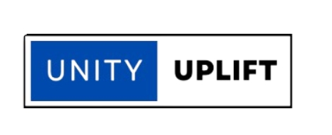
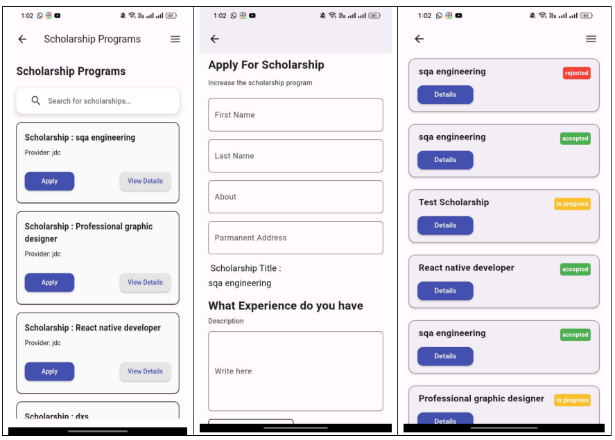
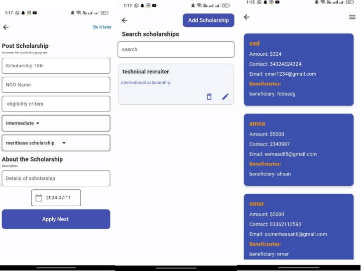

<!-- Banner -->

  

<h1 align="center">UnityUplift</h1>

Scholarship Management Application

 

## Overview

UnityUplift is a centralized platform designed to simplify the scholarship process for students, NGOs, and donors. It addresses common challenges such as complex application procedures and limited awareness of available opportunities by providing a streamlined and user-friendly system.

Students can explore scholarships, submit applications, and track their progress in real time. NGOs can efficiently manage scholarship postings and review applications through a dedicated dashboard. Donors can contribute transparently to organizations or individual students.

The platform also includes a prediction feature that estimates the likelihood of scholarship approval, along with reporting tools that help users make informed decisions.

 

## Key Features

- Centralized platform for students, NGOs, and donors  
- Simple and intuitive scholarship application process  
- Real-time application tracking and status updates  
- Scholarship approval prediction system  
- Reports and analytical insights  
- NGO dashboard for managing scholarships and applications  
- Transparent donor contribution system  
- Secure and organized data management  

 

## Application Preview

  Core modules of the UnityUplift platform

 

### Student Portal

  The student portal allows users to browse available scholarships, submit applications, and manage their funding journey through a single interface.

  

 

### Scholarship Tracking

  The tracking module provides real-time updates on application status, enabling students to monitor progress with clarity and transparency.

  

 

### NGO Management Dashboard

  The NGO dashboard enables organizations to post scholarships, review applications, and manage candidates efficiently within a structured environment.

  

 

  UnityUplift improves accessibility to educational funding through a structured, transparent, and efficient digital system.

